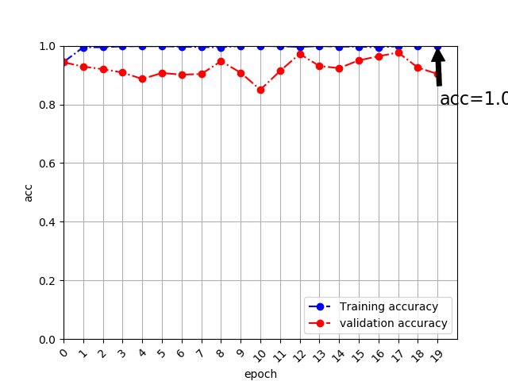
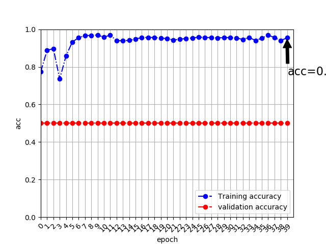

# Graduation Project for YAYA
- Evaluate quality of videos based on Machine Learning CNN model 
- using Tensorflow & keras as front-end method

# Update Item List

## 2019-04-17 07:45:41
### Training & Validation
+ #### Callback of learning reducer & Early Stoper
	 - Modify "enable switch" to "order list" for complete training flow
+ #### Differentiate between total training epoch and per step epochs of batch training
	 - nb_epoch = 20 (costum setting)
	 - batch_epoch_train/val = 40 (total sample size//batch size)
### Network Defination
+ #### Kernal regularizer setting:
	 - Tune weight of L2 regularizer to imporve Acc of Validation
		```python
		kernel_regularizer = conv_params.setdefault("kernel_regularizer", l2(1.e-4)
		l2(1.e+2) -> l2(1.e-4)
		```

### Result
#### Train & Verify
```python
Using TensorFlow backend.
There are 9600 pic
There are 4800 pic
2019-04-16 21:14:07.463700: I tensorflow/core/platform/cpu_feature_guard.cc:141] Your CPU supports instructions that this TensorFlow binary was not compiled to use: AVX2 FMA
Not using data augmentation.
Found 9600 images belonging to 2 classes.
Found 4800 images belonging to 2 classes.
Epoch 1/20
/Users/wangmingjian/.local/lib/python2.7/site-packages/keras_preprocessing/image.py:1131: UserWarning: This ImageDataGenerator specifies `featurewise_center`, but it hasn't been fit on any training data. Fit it first by calling `.fit(numpy_data)`.
  warnings.warn('This ImageDataGenerator specifies '
40/40 [==============================] - 748s 19s/step - loss: 5.0361 - acc: 0.9441 - val_loss: 4.6643 - val_acc: 0.9435
Epoch 2/20
40/40 [==============================] - 725s 18s/step - loss: 3.9859 - acc: 0.9946 - val_loss: 3.8819 - val_acc: 0.9290
Epoch 3/20
40/40 [==============================] - 714s 18s/step - loss: 3.2530 - acc: 0.9949 - val_loss: 3.2544 - val_acc: 0.9200
Epoch 4/20
40/40 [==============================] - 654s 16s/step - loss: 2.6712 - acc: 0.9979 - val_loss: 2.8074 - val_acc: 0.9085
Epoch 5/20
40/40 [==============================] - 669s 17s/step - loss: 2.2237 - acc: 0.9988 - val_loss: 2.4550 - val_acc: 0.8867
Epoch 6/20
40/40 [==============================] - 652s 16s/step - loss: 1.8776 - acc: 0.9982 - val_loss: 2.0752 - val_acc: 0.9071
Epoch 7/20
40/40 [==============================] - 629s 16s/step - loss: 1.6094 - acc: 0.9967 - val_loss: 1.7955 - val_acc: 0.9015
Epoch 8/20
40/40 [==============================] - 673s 17s/step - loss: 1.4002 - acc: 0.9954 - val_loss: 1.6075 - val_acc: 0.9035
Epoch 9/20
40/40 [==============================] - 639s 16s/step - loss: 1.2253 - acc: 0.9948 - val_loss: 1.3187 - val_acc: 0.9471
Epoch 10/20
40/40 [==============================] - 737s 18s/step - loss: 1.0685 - acc: 0.9992 - val_loss: 1.3247 - val_acc: 0.9081
Epoch 11/20
40/40 [==============================] - 698s 17s/step - loss: 0.9453 - acc: 0.9997 - val_loss: 1.3701 - val_acc: 0.8498
Epoch 12/20
40/40 [==============================] - 644s 16s/step - loss: 0.8464 - acc: 0.9982 - val_loss: 1.0646 - val_acc: 0.9140
Epoch 13/20
40/40 [==============================] - 659s 16s/step - loss: 0.7687 - acc: 0.9958 - val_loss: 0.8052 - val_acc: 0.9721
Epoch 14/20
40/40 [==============================] - 662s 17s/step - loss: 0.6873 - acc: 0.9990 - val_loss: 0.8985 - val_acc: 0.9308
Epoch 15/20
40/40 [==============================] - 625s 16s/step - loss: 0.6301 - acc: 0.9969 - val_loss: 0.8448 - val_acc: 0.9235
Epoch 16/20
40/40 [==============================] - 597s 15s/step - loss: 0.5806 - acc: 0.9970 - val_loss: 0.7210 - val_acc: 0.9502
Epoch 17/20
40/40 [==============================] - 595s 15s/step - loss: 0.5401 - acc: 0.9945 - val_loss: 0.6223 - val_acc: 0.9640
Epoch 18/20
40/40 [==============================] - 601s 15s/step - loss: 0.4879 - acc: 0.9985 - val_loss: 0.5347 - val_acc: 0.9769
Epoch 19/20
40/40 [==============================] - 602s 15s/step - loss: 0.4429 - acc: 0.9998 - val_loss: 0.6155 - val_acc: 0.9254
Epoch 20/20
40/40 [==============================] - 597s 15s/step - loss: 0.4058 - acc: 1.0000 - val_loss: 0.6472 - val_acc: 0.9037
Using real-time data augmentation.
Found 9600 images belonging to 2 classes.
Found 4800 images belonging to 2 classes.
Epoch 1/20
40/40 [==============================] - 610s 15s/step - loss: 0.6089 - acc: 0.9465 - val_loss: 8.5028 - val_acc: 0.5000
Epoch 2/20
40/40 [==============================] - 607s 15s/step - loss: 0.4670 - acc: 0.9810 - val_loss: 0.8529 - val_acc: 0.9246
Epoch 3/20
40/40 [==============================] - 606s 15s/step - loss: 0.3970 - acc: 0.9882 - val_loss: 0.6130 - val_acc: 0.9217
Epoch 4/20
40/40 [==============================] - 607s 15s/step - loss: 0.3674 - acc: 0.9867 - val_loss: 0.4259 - val_acc: 0.9640
Epoch 5/20
40/40 [==============================] - 608s 15s/step - loss: 0.3378 - acc: 0.9890 - val_loss: 0.4874 - val_acc: 0.9288
Epoch 6/20
40/40 [==============================] - 607s 15s/step - loss: 0.3163 - acc: 0.9899 - val_loss: 0.4288 - val_acc: 0.9392
Epoch 7/20
40/40 [==============================] - 607s 15s/step - loss: 0.2906 - acc: 0.9917 - val_loss: 0.3898 - val_acc: 0.9517
Epoch 8/20
40/40 [==============================] - 606s 15s/step - loss: 0.2735 - acc: 0.9932 - val_loss: 0.3746 - val_acc: 0.9487
Epoch 9/20
40/40 [==============================] - 608s 15s/step - loss: 0.2536 - acc: 0.9945 - val_loss: 0.3302 - val_acc: 0.9583
Epoch 10/20
40/40 [==============================] - 607s 15s/step - loss: 0.2426 - acc: 0.9936 - val_loss: 0.3176 - val_acc: 0.9633
Epoch 11/20
40/40 [==============================] - 608s 15s/step - loss: 0.2284 - acc: 0.9946 - val_loss: 0.2383 - val_acc: 0.9913
Epoch 12/20
40/40 [==============================] - 606s 15s/step - loss: 0.2272 - acc: 0.9917 - val_loss: 0.2372 - val_acc: 0.9875
Epoch 13/20
40/40 [==============================] - 606s 15s/step - loss: 0.2142 - acc: 0.9940 - val_loss: 0.2219 - val_acc: 0.9885
Epoch 14/20
40/40 [==============================] - 605s 15s/step - loss: 0.1946 - acc: 0.9957 - val_loss: 0.2017 - val_acc: 0.9917
Epoch 15/20
40/40 [==============================] - 604s 15s/step - loss: 0.1939 - acc: 0.9930 - val_loss: 0.2312 - val_acc: 0.9792
Epoch 16/20
40/40 [==============================] - 606s 15s/step - loss: 0.1882 - acc: 0.9934 - val_loss: 0.3576 - val_acc: 0.9350
Epoch 17/20
40/40 [==============================] - 605s 15s/step - loss: 0.1794 - acc: 0.9944 - val_loss: 0.1824 - val_acc: 0.9923
Epoch 18/20
40/40 [==============================] - 606s 15s/step - loss: 0.1656 - acc: 0.9956 - val_loss: 0.1869 - val_acc: 0.9869
Epoch 19/20
40/40 [==============================] - 608s 15s/step - loss: 0.1646 - acc: 0.9946 - val_loss: 0.2104 - val_acc: 0.9752
Epoch 20/20
40/40 [==============================] - 607s 15s/step - loss: 0.1636 - acc: 0.9933 - val_loss: 0.1754 - val_acc: 0.9873

```



#### Status
+ ##### Train
	 - Finish First stage & Model Done(without Data Augmentation) [Done]
	 - Training with date augmentation [On Going]
+ ##### Test
	 - Update dataset for Test and release [Done]
	 - New create script to process video for test [On Going]
+ ##### Evaluate
	 - TO DO
+ ##### Thesis writing
	 - TO DO (None of my business)

## 2019-04-15 22:52:32
### Training & Validation
+ #### Callback of learning reducer & Early Stoper
	 - Switch Turn [OFF->ON]
+ #### Optimizer change keep Adam
	 -  parameter setting:
	 	```python
		learnRate = 1.e-2
		lr_decay = 0.0
		beta_1 = 0.9,
		beta_2 = 0.999
		epsilon = 1.e-8
		amsgrad = False
		```
+ #### Add method of plot for feedback debug (FirstTrain) and Data Augmentation process

### Network Defination
+ #### Kernal regularizer setting:
	 - Tune weight of L2 regularizer to imporve Acc of Validation
		```python
		kernel_regularizer = conv_params.setdefault("kernel_regularizer", l2(1.e+2)
		l2(1.e+4) -> l2(1.e+2)
		```

### Result
#### Train & Verify
```python
#Trial Run Result
#Reduce epoch 40 to 4
There are 9600 pic
There are 4800 pic
Not using data augmentation.
Found 9600 images belonging to 2 classes.
Found 4800 images belonging to 2 classes.
Epoch 1/4
40/40 [==============================] - 601s 15s/step - loss: 0.1517 - acc: 0.9524 - val_loss: 0.5036 - val_acc: 0.9250
Epoch 2/4
40/40 [==============================] - 578s 14s/step - loss: 0.0132 - acc: 0.9956 - val_loss: 0.1471 - val_acc: 0.9542
Epoch 3/4
40/40 [==============================] - 585s 15s/step - loss: 0.0062 - acc: 0.9981 - val_loss: 0.1386 - val_acc: 0.9729
Epoch 4/4
40/40 [==============================] - 676s 17s/step - loss: 0.0064 - acc: 0.9977 - val_loss: 0.0950 - val_acc: 0.9750
Using real-time data augmentation.
coil-100_BlurredSharpRecognize_train.py:224: UserWarning: Update your `fit_generator` call to the Keras 2 API: `fit_generator(<keras_pre..., epochs=4, max_queue_size=10, validation_data=(array([[[..., steps_per_epoch=40, verbose=1)`
  plt.plot(epoch,history.history['val_acc'],'ro-.', label="validation accuracy")
Epoch 1/4
40/40 [==============================] - 691s 17s/step - loss: 0.7068 - acc: 0.5108 - val_loss: 0.7758 - val_acc: 0.5158
Epoch 2/4
40/40 [==============================] - 685s 17s/step - loss: 0.7865 - acc: 0.5146 - val_loss: 0.7114 - val_acc: 0.5000
Epoch 3/4
40/40 [==============================] - 658s 16s/step - loss: 0.6802 - acc: 0.5215 - val_loss: 0.6820 - val_acc: 0.5163
Epoch 4/4
40/40 [==============================] - 622s 16s/step - loss: 0.6806 - acc: 0.5140 - val_loss: 0.6940 - val_acc: 0.5163
```


#### Status
+ ##### Train
	 - Finish First stage & Model Done(without Data Augmentation)
+ ##### Test
	 - New create dataset for Test and release
	 - [On Going]
+ ##### Evaluate
	 - TO DO

## 2019-04-07 18:35:58
### Training & Validation
+ #### Callback of learning reducer & Early Stoper
	 - Switch Off
+ #### Optimizer change from Adadelta to Adam
	 -  parameter setting:
	 	```python
		learnRate = 1.e-4
		lr_decay = 0.5
		beta_1 = 0.9,
		beta_2 = 0.999
		epsilon = 1.e-8
		```
+ #### Add plot for feedback debug (FirstTrain)

### Network Defination
+ #### Kernal regularizer setting:
	 - Enlarge weight of L2 regularizer to imporve Acc of Validation
		```python
		kernel_regularizer = conv_params.setdefault("kernel_regularizer", l2(1.e+4)
		l2(1.e-6) -> l2(1.e+4)
		```
+ #### Change Block type:
	 -  From Bottleneck to Basic

### Result
#### Train & Verify
```python
Epoch 1/75
75/75 [==============================] - 236s 3s/step - loss: 0.2022 - acc: 0.9233 - val_loss: 0.8762 - val_acc: 0.7290
Epoch 2/75
75/75 [==============================] - 206s 3s/step - loss: 0.0730 - acc: 0.9750 - val_loss: 1.2042 - val_acc: 0.6464
Epoch 3/75
75/75 [==============================] - 207s 3s/step - loss: 0.0589 - acc: 0.9804 - val_loss: 1.1341 - val_acc: 0.6323
Epoch 4/75
75/75 [==============================] - 212s 3s/step - loss: 0.0427 - acc: 0.9871 - val_loss: 2.0977 - val_acc: 0.6391
Epoch 5/75
75/75 [==============================] - 206s 3s/step - loss: 0.0408 - acc: 0.9877 - val_loss: 2.3598 - val_acc: 0.6007
Epoch 6/75
75/75 [==============================] - 201s 3s/step - loss: 0.0431 - acc: 0.9877 - val_loss: 2.0185 - val_acc: 0.5926
Epoch 7/75
75/75 [==============================] - 200s 3s/step - loss: 0.0250 - acc: 0.9942 - val_loss: 3.6248 - val_acc: 0.5301
Epoch 8/75
75/75 [==============================] - 200s 3s/step - loss: 0.0196 - acc: 0.9965 - val_loss: 1.8678 - val_acc: 0.6203
Epoch 9/75
75/75 [==============================] - 210s 3s/step - loss: 0.0210 - acc: 0.9948 - val_loss: 1.8447 - val_acc: 0.6073
Epoch 10/75
75/75 [==============================] - 207s 3s/step - loss: 0.0264 - acc: 0.9935 - val_loss: 1.7963 - val_acc: 0.6598
Epoch 11/75
75/75 [==============================] - 211s 3s/step - loss: 0.0180 - acc: 0.9973 - val_loss: 1.1418 - val_acc: 0.6858
......
```
#### Status
+ ##### Train
	 - On going & Cross check
+ ##### Test
	 - Debug...
+ ##### Evaluate
	 - Not start
