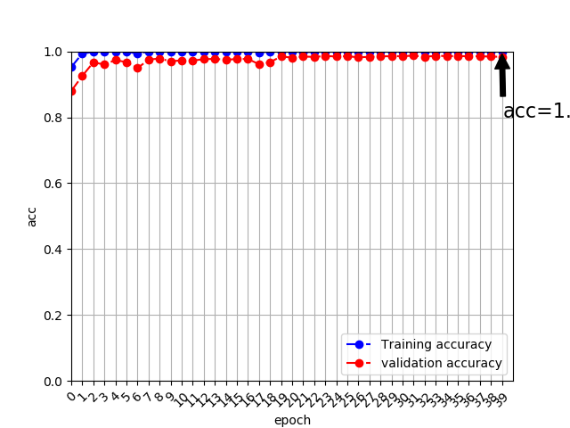
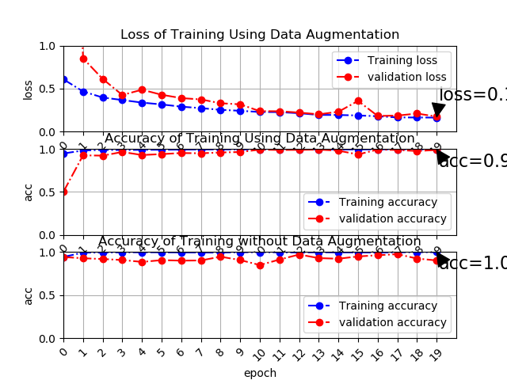

# Update Item List

## 2019-04-15 22:52:32
### Training & Validation
+ #### Callback of learning reducer & Early Stoper
	 - Switch Turn [OFF->ON]
+ #### Optimizer change keep Adam
	 -  parameter setting:
	 	```python
		learnRate = 1.e-2
		lr_decay = 0.0
		beta_1 = 0.9,
		beta_2 = 0.999
		epsilon = 1.e-8
		amsgrad = False
		```
+ #### Add method of plot for feedback debug (FirstTrain) and Data Augmentation process

### Network Defination
+ #### Kernal regularizer setting:
	 - Tune weight of L2 regularizer to imporve Acc of Validation
		```python
		kernel_regularizer = conv_params.setdefault("kernel_regularizer", l2(1.e+2)
		l2(1.e+4) -> l2(1.e+2)
		```

### Result
#### Train & Verify
```python
#Trial Run Result
#Reduce epoch 40 to 4
There are 9600 pic
There are 4800 pic
Not using data augmentation.
Found 9600 images belonging to 2 classes.
Found 4800 images belonging to 2 classes.
Epoch 1/4
40/40 [==============================] - 601s 15s/step - loss: 0.1517 - acc: 0.9524 - val_loss: 0.5036 - val_acc: 0.9250
Epoch 2/4
40/40 [==============================] - 578s 14s/step - loss: 0.0132 - acc: 0.9956 - val_loss: 0.1471 - val_acc: 0.9542
Epoch 3/4
40/40 [==============================] - 585s 15s/step - loss: 0.0062 - acc: 0.9981 - val_loss: 0.1386 - val_acc: 0.9729
Epoch 4/4
40/40 [==============================] - 676s 17s/step - loss: 0.0064 - acc: 0.9977 - val_loss: 0.0950 - val_acc: 0.9750
Using real-time data augmentation.
coil-100_BlurredSharpRecognize_train.py:224: UserWarning: Update your `fit_generator` call to the Keras 2 API: `fit_generator(<keras_pre..., epochs=4, max_queue_size=10, validation_data=(array([[[..., steps_per_epoch=40, verbose=1)`
  plt.plot(epoch,history.history['val_acc'],'ro-.', label="validation accuracy")
Epoch 1/4
40/40 [==============================] - 691s 17s/step - loss: 0.7068 - acc: 0.5108 - val_loss: 0.7758 - val_acc: 0.5158
Epoch 2/4
40/40 [==============================] - 685s 17s/step - loss: 0.7865 - acc: 0.5146 - val_loss: 0.7114 - val_acc: 0.5000
Epoch 3/4
40/40 [==============================] - 658s 16s/step - loss: 0.6802 - acc: 0.5215 - val_loss: 0.6820 - val_acc: 0.5163
Epoch 4/4
40/40 [==============================] - 622s 16s/step - loss: 0.6806 - acc: 0.5140 - val_loss: 0.6940 - val_acc: 0.5163
```



#### Status
+ ##### Train
	 - Finish First stage & Model Done(without Data Augmentation)
+ ##### Test
	 - New create dataset for Test and release
	 - [On Going]
+ ##### Evaluate
	 - TO DO

## 2019-04-07 18:35:58
### Training & Validation
+ #### Callback of learning reducer & Early Stoper
	 - Switch Off
+ #### Optimizer change from Adadelta to Adam
	 -  parameter setting:
	 	```python
		learnRate = 1.e-4
		lr_decay = 0.5
		beta_1 = 0.9,
		beta_2 = 0.999
		epsilon = 1.e-8
		```
+ #### Add plot for feedback debug (FirstTrain)

### Network Defination
+ #### Kernal regularizer setting:
	 - Enlarge weight of L2 regularizer to imporve Acc of Validation
		```python
		kernel_regularizer = conv_params.setdefault("kernel_regularizer", l2(1.e+4)
		l2(1.e-6) -> l2(1.e+4)
		```
+ #### Change Block type:
	 -  From Bottleneck to Basic

### Result
#### Train & Verify
```python
Epoch 1/75
75/75 [==============================] - 236s 3s/step - loss: 0.2022 - acc: 0.9233 - val_loss: 0.8762 - val_acc: 0.7290
Epoch 2/75
75/75 [==============================] - 206s 3s/step - loss: 0.0730 - acc: 0.9750 - val_loss: 1.2042 - val_acc: 0.6464
Epoch 3/75
75/75 [==============================] - 207s 3s/step - loss: 0.0589 - acc: 0.9804 - val_loss: 1.1341 - val_acc: 0.6323
Epoch 4/75
75/75 [==============================] - 212s 3s/step - loss: 0.0427 - acc: 0.9871 - val_loss: 2.0977 - val_acc: 0.6391
Epoch 5/75
75/75 [==============================] - 206s 3s/step - loss: 0.0408 - acc: 0.9877 - val_loss: 2.3598 - val_acc: 0.6007
Epoch 6/75
75/75 [==============================] - 201s 3s/step - loss: 0.0431 - acc: 0.9877 - val_loss: 2.0185 - val_acc: 0.5926
Epoch 7/75
75/75 [==============================] - 200s 3s/step - loss: 0.0250 - acc: 0.9942 - val_loss: 3.6248 - val_acc: 0.5301
Epoch 8/75
75/75 [==============================] - 200s 3s/step - loss: 0.0196 - acc: 0.9965 - val_loss: 1.8678 - val_acc: 0.6203
Epoch 9/75
75/75 [==============================] - 210s 3s/step - loss: 0.0210 - acc: 0.9948 - val_loss: 1.8447 - val_acc: 0.6073
Epoch 10/75
75/75 [==============================] - 207s 3s/step - loss: 0.0264 - acc: 0.9935 - val_loss: 1.7963 - val_acc: 0.6598
Epoch 11/75
75/75 [==============================] - 211s 3s/step - loss: 0.0180 - acc: 0.9973 - val_loss: 1.1418 - val_acc: 0.6858
......
```
#### Status
+ ##### Train
	 - On going & Cross check
+ ##### Test
	 - Debug...
+ ##### Evaluate
	 - Not start
